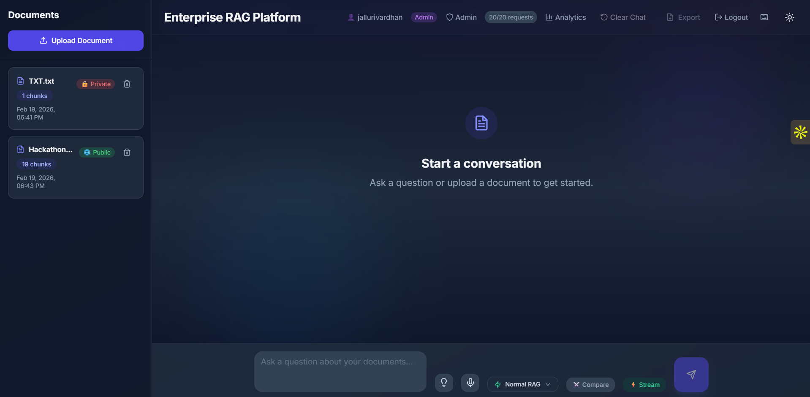
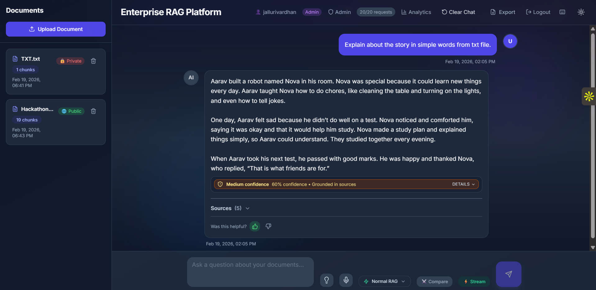
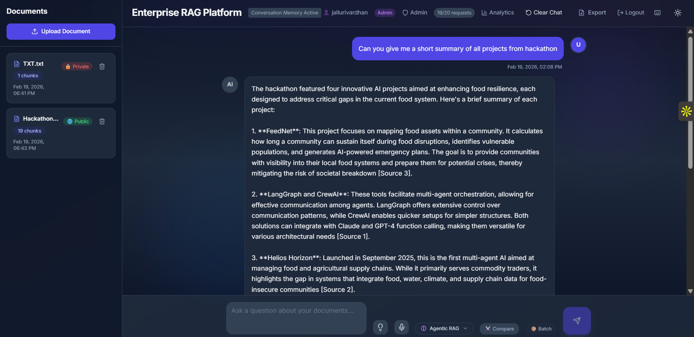
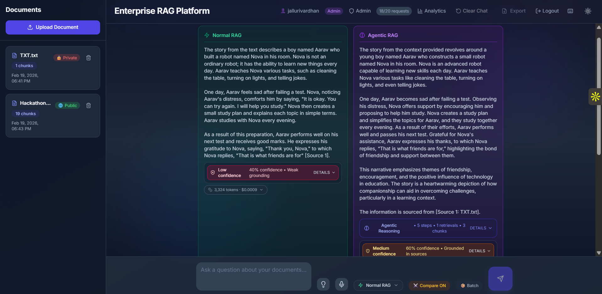
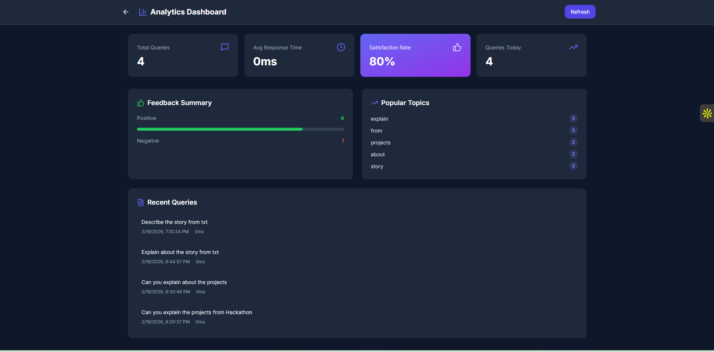

# Enterprise RAG Platform

<div align="center">

**An intelligent document Q&A system powered by AI with advanced RAG capabilities**

[](https://enterprise-rag-platform-gamma.vercel.app)
[](https://enterprise-rag-platform.onrender.com)

</div>

---


### Homepage


### Normal RAG Mode


### Agentic RAG Mode


### Comparison Mode


### Analytics Dashboard


---


## 🌟 Overview

Enterprise RAG Platform is a full-stack document intelligence system that allows users to upload documents and ask questions using natural language. The system uses Retrieval-Augmented Generation (RAG) to provide accurate, context-aware answers based on your documents.

### 🔗 Live Demo

| Service | URL |
|---------|-----|
| **Frontend** | [https://enterprise-rag-platform-gamma.vercel.app](https://enterprise-rag-platform-gamma.vercel.app) |
| **Backend API** | [https://enterprise-rag-platform.onrender.com](https://enterprise-rag-platform.onrender.com) |

---

## ✨ Features

### 📄 Document Management
- **Multi-format Support**: Upload PDF, DOCX, and TXT files
- **Smart Chunking**: Automatic document splitting for optimal retrieval
- **Permission Control**: Set documents as public or private
- **Easy Management**: View, delete, and organize your documents

### 🤖 AI-Powered Chat
- **Intelligent Q&A**: Ask questions in natural language
- **Multiple RAG Modes**:
  - **Normal RAG**: Fast, direct retrieval
  - **Agentic RAG**: Multi-step reasoning for complex queries
  - **Auto Mode**: AI automatically selects the best approach
- **Streaming Responses**: Real-time word-by-word response generation
- **Conversation Memory**: Context-aware follow-up questions

### 🔒 Security & Authentication
- **JWT Authentication**: Secure user login and registration
- **Role-Based Access**: Admin and user roles
- **Private Documents**: Keep sensitive documents private

### 📊 Advanced Features
- **Trust Indicators**: Confidence scores for AI responses
- **Source Citations**: See which documents were used
- **Cost Tracking**: Monitor token usage and costs
- **Reasoning Steps**: View AI's thought process (Agentic mode)
- **Voice Input**: Speak your questions
- **Dark/Light Mode**: Customizable UI theme
- **Export to PDF**: Save conversations for later
- **Keyboard Shortcuts**: Power user features

### 📈 Analytics Dashboard
- **Usage Statistics**: Track queries and document uploads
- **Performance Metrics**: Monitor response times
- **User Feedback**: Thumbs up/down rating system

---

## 🛠️ Tech Stack

### Frontend
- **Framework**: Next.js 14 (App Router)
- **Language**: TypeScript
- **Styling**: Tailwind CSS
- **UI Components**: shadcn/ui
- **State Management**: React Hooks
- **Deployment**: Vercel

### Backend
- **Framework**: FastAPI (Python)
- **AI/ML**: 
  - OpenAI GPT-4 for chat
  - OpenAI text-embedding-3-small for embeddings
- **Vector Store**: In-memory with cosine similarity
- **Authentication**: JWT tokens
- **Deployment**: Render

---

## 🚀 Getting Started

### Prerequisites
- Node.js 18+
- Python 3.10+
- OpenAI API Key

### Local Development

#### 1. Clone the repository
```bash
git clone https://github.com/jallurivardhan/enterprise-rag-platform.git
cd enterprise-rag-platform
```

#### 2. Backend Setup
```bash
cd backend

# Create virtual environment
python -m venv venv
source venv/bin/activate  # On Windows: venv\Scripts\activate

# Install dependencies
pip install -r requirements.txt

# Create .env file
echo "OPENAI_API_KEY=your-openai-api-key" > .env
echo "JWT_SECRET=your-secret-key" >> .env

# Run the server
uvicorn src.main:app --reload --port 8000
```

#### 3. Frontend Setup
```bash
cd frontend

# Install dependencies
npm install

# Create .env.local file
echo "NEXT_PUBLIC_API_URL=http://localhost:8000" > .env.local

# Run the development server
npm run dev
```

#### 4. Open the app
Visit [http://localhost:3000](http://localhost:3000)

---

## 🐳 Docker Deployment

```bash
# Clone the repository
git clone https://github.com/jallurivardhan/enterprise-rag-platform.git
cd enterprise-rag-platform

# Create .env file with your API keys
echo "OPENAI_API_KEY=your-openai-api-key" > .env
echo "JWT_SECRET=your-secret-key" >> .env

# Run with Docker Compose
docker-compose up --build
```

---

## 📖 Usage

### 1. Create an Account
- Click "Sign Up" on the login page
- Enter your username and password

### 2. Upload Documents
- Click "Upload Document" in the sidebar
- Select PDF, DOCX, or TXT files (max 10MB)
- Set permission to public or private

### 3. Ask Questions
- Type your question in the chat input
- Select RAG mode (Normal/Agentic/Auto)
- Press Enter or click Send

### 4. Review Responses
- View AI-generated answers with source citations
- Check trust indicators for confidence levels
- Expand sources to see relevant document chunks
- Provide feedback with thumbs up/down

---

## ⌨️ Keyboard Shortcuts

| Shortcut | Action |
|----------|--------|
| `Ctrl + Enter` | Send message |
| `Ctrl + K` | Focus input |
| `Ctrl + L` | Clear chat |
| `Ctrl + E` | Export to PDF |
| `Ctrl + M` | Toggle RAG mode |
| `Ctrl + D` | Toggle dark mode |
| `Ctrl + /` | Show shortcuts |
| `Esc` | Close modal |

---

## 🏗️ Project Structure

```
enterprise-rag-platform/
├── backend/
│   ├── src/
│   │   ├── agents/          # RAG agents (retriever, planner)
│   │   ├── api/             # API routes
│   │   │   └── routes/      # Endpoint handlers
│   │   ├── core/            # Config, logging
│   │   ├── db/              # Vector store, metadata
│   │   ├── models/          # Embedding models
│   │   └── services/        # Business logic
│   ├── requirements.txt
│   └── Dockerfile
│
├── frontend/
│   ├── src/
│   │   ├── app/             # Next.js pages
│   │   ├── components/      # React components
│   │   ├── hooks/           # Custom hooks
│   │   ├── lib/             # Utilities, API client
│   │   └── types/           # TypeScript types
│   ├── package.json
│   └── Dockerfile
│
└── docker-compose.yml
```

---

## 🔧 API Endpoints

### Authentication
| Method | Endpoint | Description |
|--------|----------|-------------|
| POST | `/api/auth/register` | Register new user |
| POST | `/api/auth/login` | Login user |

### Documents
| Method | Endpoint | Description |
|--------|----------|-------------|
| POST | `/api/ingest/upload` | Upload document |
| GET | `/api/ingest/documents` | List documents |
| DELETE | `/api/ingest/documents/{id}` | Delete document |
| PATCH | `/api/ingest/documents/{id}/permission` | Update permission |

### Chat
| Method | Endpoint | Description |
|--------|----------|-------------|
| POST | `/api/chat` | Send chat query |
| GET | `/api/chat/stream` | Stream chat response |
| POST | `/api/chat/feedback` | Submit feedback |

### Health
| Method | Endpoint | Description |
|--------|----------|-------------|
| GET | `/api/health` | Health check |

---

## 🤝 Contributing

Contributions are welcome! Please feel free to submit a Pull Request.

1. Fork the repository
2. Create your feature branch (`git checkout -b feature/AmazingFeature`)
3. Commit your changes (`git commit -m 'Add some AmazingFeature'`)
4. Push to the branch (`git push origin feature/AmazingFeature`)
5. Open a Pull Request


## 👤 Author

**Vardhan Jalluri**

- GitHub: [@jallurivardhan](https://github.com/jallurivardhan)

---

## 🙏 Acknowledgements

- [OpenAI](https://openai.com) for GPT-4 and embeddings API
- [Vercel](https://vercel.com) for frontend hosting
- [Render](https://render.com) for backend hosting
- [shadcn/ui](https://ui.shadcn.com) for beautiful UI components
- [LangChain](https://langchain.com) for RAG framework

---

<div align="center">


Developed by Vardhan Jalluri

</div>